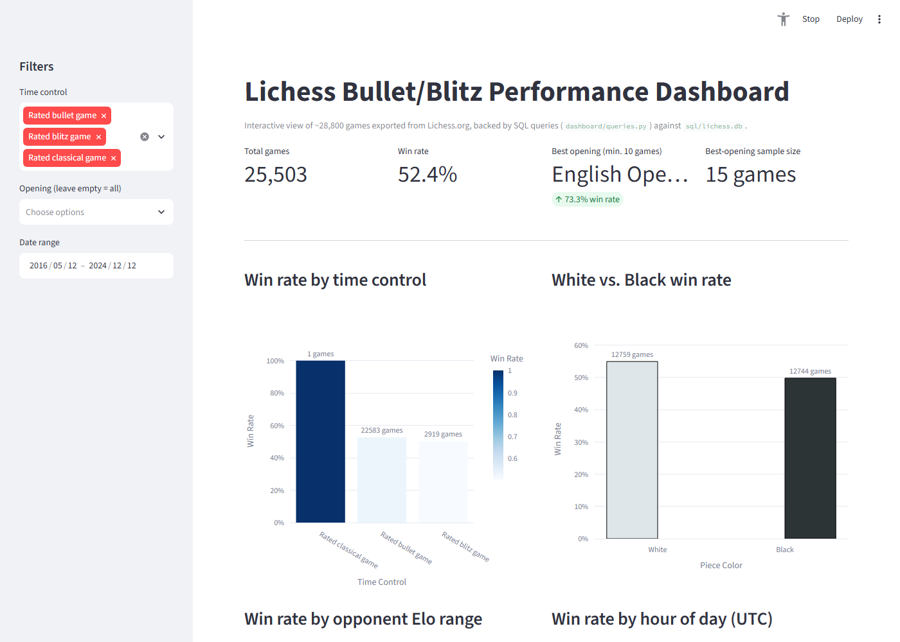
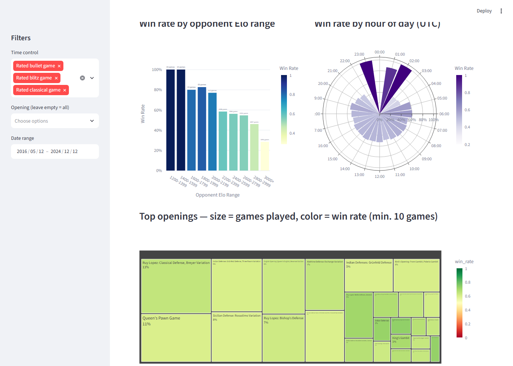

# Lichess Bullet Chess Performance Analysis

A data analyst portfolio project analyzing ~28,800 chess games played on
[Lichess.org](https://lichess.org), covering data cleaning, exploratory
analysis, a SQL analytics layer, hypothesis testing, a Logistic Regression
model, and an interactive dashboard.

## Project Goal

Answer a set of concrete performance questions from raw game history: which
time control is played best, whether the white-piece advantage shows up in
practice, whether performance holds up against much stronger opponents,
which openings work best, and which single factor (rating gap, piece
color, time pressure, or hour of day) best predicts a game's outcome.

## Data Source

Raw data is a PGN (Portable Game Notation) export downloaded directly from
a Lichess account's game history — one text block per game, with metadata
tags (`Event`, `White`, `Black`, `Result`, `WhiteElo`, `ECO`, ...) followed
by the move list. See [`data/raw/my_lichess_history.txt`](data/raw/my_lichess_history.txt).

## Tech Stack

- **Python / pandas** — PGN parsing and data cleaning ([`notebooks/data_pipeline.py`](notebooks/data_pipeline.py))
- **Jupyter Notebook** — exploratory analysis, hypothesis testing, modeling ([`notebooks/lichess_analysis.ipynb`](notebooks/lichess_analysis.ipynb))
- **SQL / SQLite** — GROUP BY, CASE WHEN and window-function analyses ([`/sql`](sql))
- **scikit-learn / imbalanced-learn** — Logistic Regression with SMOTE oversampling
- **Streamlit / Plotly** — interactive dashboard ([`/dashboard`](dashboard))

## Repository Structure

```
data/
  raw/            original PGN export
  processed/      cleaned, feature-enriched CSV
notebooks/
  data_pipeline.py      shared cleaning/feature-engineering logic
  eco_codes.py           ECO code -> opening name lookup table
  lichess_analysis.ipynb the full analysis notebook
sql/
  build_database.py      loads the processed CSV into SQLite
  lichess.db              generated SQLite database
  01-05_*.sql             five standalone analysis queries
dashboard/
  queries.py              parametrized SQL used by the dashboard
  app.py                  Streamlit app
  screenshots/            local-run screenshots used in this README
requirements.txt
```

## Key Findings

- **Best opening: Ruy Lopez (Berlin Defense).** Across rated bullet games with at least 20 games played, the Berlin Defense has the highest win rate at **77.8%** (35/45 games) — see [`sql/02_winrate_by_opening.sql`](sql/02_winrate_by_opening.sql).
- **The white-piece advantage is real, here too.** In rated bullet games, playing White wins **55.2%** of the time versus **50.1%** as Black — a ~5-point edge consistent with the first-move advantage chess theory predicts.
- **Performance drops significantly against much stronger opponents.** A two-sample t-test comparing win rate against opponents rated above 2900 vs. everyone else rejects the null hypothesis of equal performance (p < 0.001) — see Section 7.1 of the notebook.
- **Time pressure matters more than the clock alone would suggest.** In a Logistic Regression model predicting win/draw/loss from rating gap, piece color, time-forfeit terminations and hour of day, **time-forfeit outcomes and rating gap were the two strongest predictors** — stronger than color or hour — at 58% test accuracy (vs. a ~53% majority-class baseline).

> Some intermediate notebook cells (feature engineering for the model, the
> ECO→opening name mapping, the combined opening win-rate table) were
> missing from the original saved notebook and have been reconstructed;
> each is marked **[RECONSTRUCTED]** in the notebook with the assumption it
> makes stated explicitly.

## Running the Project

### 1. Set up the environment

```bash
python -m venv .venv
source .venv/bin/activate   # Windows: .venv\Scripts\activate
pip install -r requirements.txt
```

### 2. Regenerate the processed data (optional — already included)

```bash
jupyter nbconvert --to notebook --execute --inplace notebooks/lichess_analysis.ipynb
```

### 3. Build the SQLite database

```bash
python sql/build_database.py
```

### 4. Run the dashboard

```bash
streamlit run dashboard/app.py
```

Then open the local URL Streamlit prints (defaults to `http://localhost:8501`).

## Live Demo / Screenshots

**Live demo:** [lichessanalyzer-kunhdct4haer6ezadhndcf.streamlit.app](https://lichessanalyzer-kunhdct4haer6ezadhndcf.streamlit.app/)
_(free-tier hosting — first load after idle can take ~15-20s to wake up)_

Screenshots from a local run:




### Deploying the dashboard (Streamlit Community Cloud, free)

1. Go to [share.streamlit.io](https://share.streamlit.io) and sign in with your GitHub account.
2. Click **New app** → select the `Lichess_Analyzer` repo, branch `main`.
3. Set **Main file path** to `dashboard/app.py`.
4. Deploy. Streamlit Cloud automatically picks up [`dashboard/requirements.txt`](dashboard/requirements.txt) (a lean dependency list scoped to just the dashboard) instead of the full project `requirements.txt`.
5. Once live, copy the app URL back into this README's "Live demo" line above.
