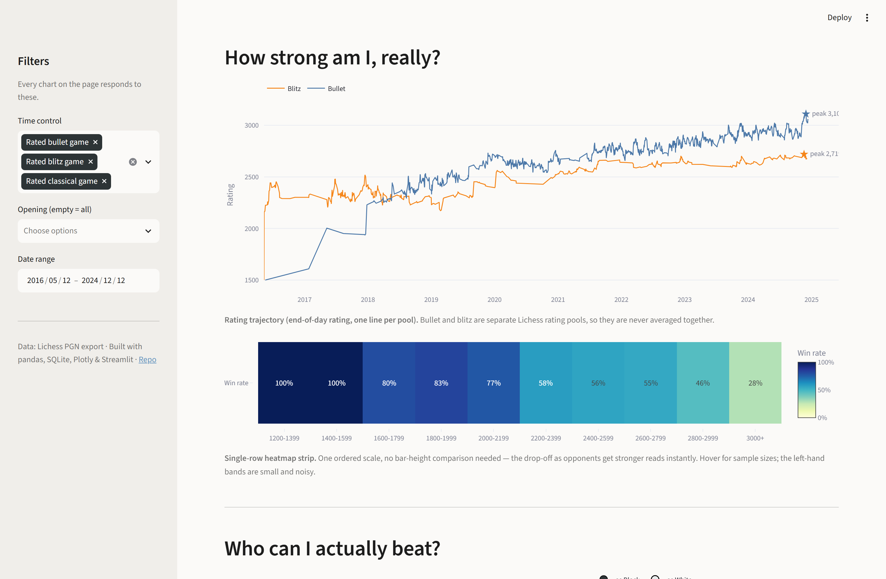
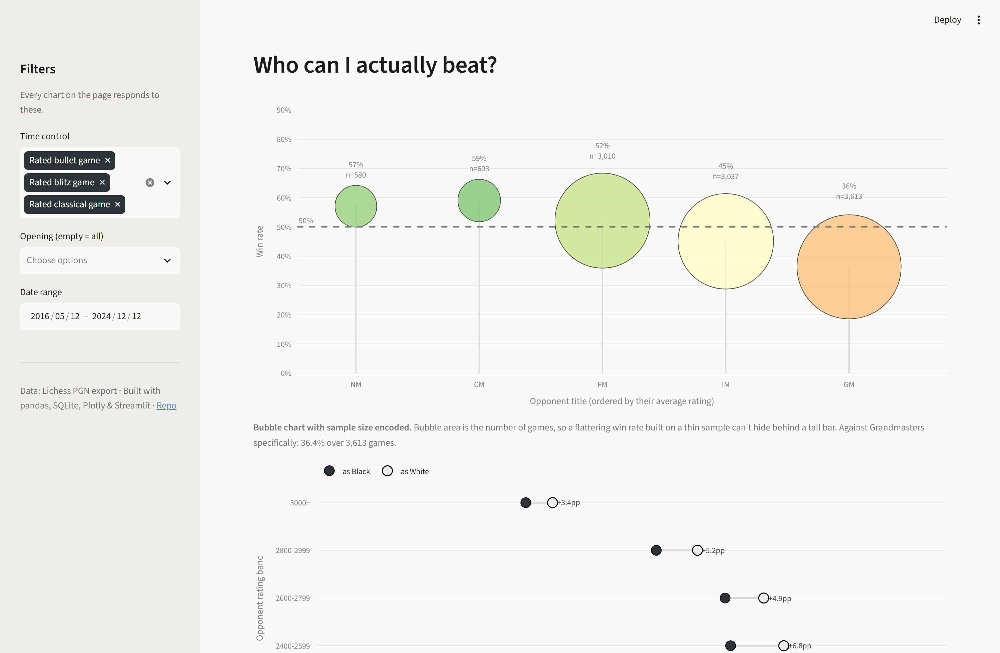
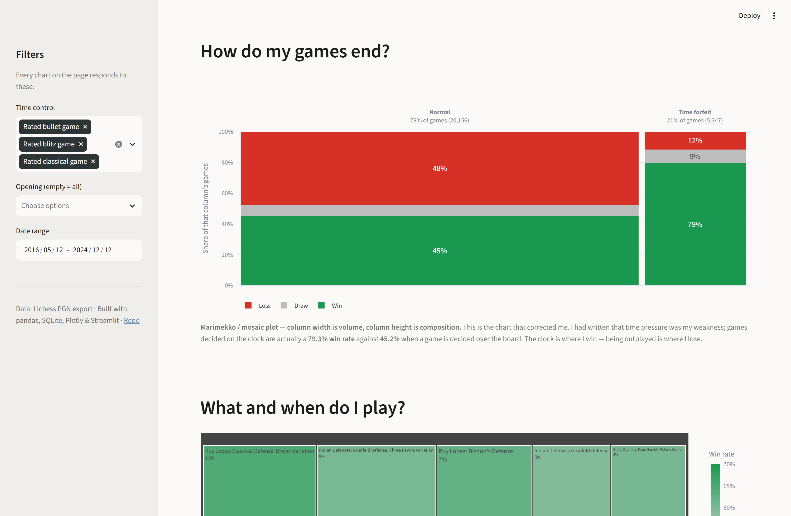

# Lichess Chess Performance Analytics

An end-to-end data analytics project built on 28,800+ games played on
[Lichess.org](https://lichess.org) by [legend2014](https://lichess.org/@/legend2014),
a friend's account, covering the full path from a raw PGN export to a
deployed interactive dashboard.
The project reimplements and extends an original university report — data
extraction, cleaning, exploratory analysis, hypothesis testing, and a
logistic regression model — and adds a SQL analytics layer and a Streamlit +
Plotly dashboard on top.

## Project Overview

The analysis is organized around a set of concrete, testable questions
about the player's game history:

- Does win rate hold up against much higher-rated opponents?
- Does the White-piece advantage show up in practice, and does it hold at
  every opponent-strength level?
- Which time control (bullet, blitz, classical) is played most effectively?
- Does time of day (UTC) correlate with performance?
- Which openings produce the best results, at a defensible sample size?
- Are games more often won on the clock ("Time forfeit") or over the board
  ("Normal")?
- Of rating gap, piece color, time pressure, and hour of day, which factor
  is most associated with winning?

## Data Source

The raw data is a PGN (Portable Game Notation) export of the full game
history of the Lichess account `legend2014`, which belongs to a friend of
the author — one metadata block plus move list per game. See
[`data/raw/my_lichess_history.txt`](data/raw/my_lichess_history.txt).

Fields used by the analysis include `Event` (time control), `White` /
`Black` (usernames), `Result`, `WhiteElo` / `BlackElo`, `WhiteTitle` /
`BlackTitle`, `ECO` (opening code), `Termination`, and `UTCDate` / `UTCTime`.
The move list itself (`Moves`) is parsed but dropped during cleaning — no
analysis in this project operates at the move level, and it accounts for
most of the raw file's size.

## Tech Stack

- **Python / pandas / numpy** — PGN parsing, cleaning, feature engineering ([`notebooks/data_pipeline.py`](notebooks/data_pipeline.py))
- **Jupyter Notebook** — EDA, hypothesis testing, modeling ([`notebooks/lichess_analysis.ipynb`](notebooks/lichess_analysis.ipynb))
- **matplotlib / seaborn** — static charts in the notebook's EDA and hypothesis-testing sections
- **SQL / SQLite** — `GROUP BY`, `CASE WHEN`, CTEs, and window functions ([`/sql`](sql))
- **scipy** — hypothesis testing (Welch's t-test)
- **scikit-learn** — Logistic Regression, `StandardScaler`, `train_test_split`, evaluation metrics
- **imbalanced-learn** — SMOTE oversampling for class imbalance
- **Streamlit / Plotly** — interactive dashboard ([`/dashboard`](dashboard))

## Data Pipeline

```
Raw PGN Data
  → Data Cleaning
    → Feature Engineering
      → Exploratory Data Analysis
        → SQL Analysis
          → Statistical Testing
            → Machine Learning
              → Interactive Dashboard
```

`notebooks/data_pipeline.py` is the single source of truth for the cleaning
and feature-engineering stages — its output feeds the notebook, the SQLite
build script, and the dashboard identically, so all three stay in sync.

## Data Cleaning and Feature Engineering

Cleaning (`clean_games`) drops columns not used anywhere downstream (`FEN`,
`SetUp`, `Site`, `Date`, `Moves`) and derives `ResultStatus`
(win / loss / draw) from `Result` relative to the player's color.

Feature enrichment (`enrich_games`) then derives:

- `Date` and `Hour` — parsed from `UTCDate` / `UTCTime`
- `Opening` — mapped from the `ECO` code via a lookup table ([`notebooks/eco_codes.py`](notebooks/eco_codes.py))
- `OpponentElo` / `OpponentEloRange` — the non-player side's rating, binned into 200-point ranges
- `PlayerColor` — White or Black, based on which side the player was on
- `IsRanked` — whether the game was a rated bullet/blitz/classical game

Sections of the pipeline and notebook marked **[RECONSTRUCTED]** reproduce
logic that existed in the original notebook but whose source cells were
lost (only cached outputs survived); each is re-implemented with the most
defensible interpretation of the original approach, stated inline.

## Exploratory Data Analysis

- **Win rate by time control** — bullet vs. blitz vs. classical, the three
  rated Lichess pools (kept as separate series throughout; never averaged
  together).
- **White vs. Black** — overall win rate split by piece color.
- **Activity over time** — monthly game volume.
- **Win rate by opponent Elo range** — performance across 200-point rating
  bands.
- **Win rate by hour of day (UTC)**.
- **Opening performance** — White-side and Black-side results per opening,
  combined into a single per-opening win rate, filtered to a minimum game
  count.

## SQL Analysis

Five standalone queries in [`/sql`](sql) answer the project's core
questions directly against the SQLite database, each demonstrating a
distinct SQL technique:

| Query | Technique |
|---|---|
| [`01_winrate_by_mode.sql`](sql/01_winrate_by_mode.sql) | `GROUP BY` + `CASE WHEN` aggregation |
| [`02_winrate_by_opening.sql`](sql/02_winrate_by_opening.sql) | CTE (`WITH`) + `RANK() OVER` window function |
| [`03_winrate_by_elo_range.sql`](sql/03_winrate_by_elo_range.sql) | `CASE WHEN` bucketing into Elo bands |
| [`04_winrate_by_hour.sql`](sql/04_winrate_by_hour.sql) | `GROUP BY` with a part-of-day `CASE WHEN` label |
| [`05_activity_trend.sql`](sql/05_activity_trend.sql) | `AVG() OVER` (moving average), `SUM() OVER` (running total), `LAG()` (month-over-month change) |

[`dashboard/queries.py`](dashboard/queries.py) reimplements the same
analyses — plus opponent title, color-by-Elo-band, and termination-type
breakdowns — as parametrized functions filtered by time control, opening,
and date range, behind a shared `_where_clause` helper.

## Statistical Analysis

Two hypothesis tests, both Welch's two-sample t-tests (`scipy.stats.
ttest_ind`, unequal variance), in section 7 of the notebook:

- **Opponent strength.** H0: win rate against opponents rated above 2900 is
  the same as against everyone else. The test rejects H0 (p < 0.001) —
  performance measurably declines against that cohort.
- **Termination type.** Compares outcomes in games decided normally
  (checkmate/resignation) against games decided on the clock (time
  forfeit), to test whether one is associated with better results than the
  other.

## Machine Learning

A secondary, exploratory piece of the analysis: a multi-class **Logistic
Regression** model (`scikit-learn`) predicts game outcome (win / draw /
loss) from four candidate factors — `EloDiff` (rating gap), `IsWhite`
(piece color), `IsTimeForfeit` (termination type), and `Hour` (time of
day). Features are scaled with `StandardScaler`; because outcome classes
are imbalanced, the training set is oversampled with **SMOTE**
(`imbalanced-learn`) before fitting. The model is evaluated with accuracy
and a full classification report on a held-out test split, and feature
importance is read off the mean absolute coefficient across the three
outcome classes.

## Interactive Dashboard

**Live demo:** [lichessanalyzer-kunhdct4haer6ezadhndcf.streamlit.app](https://lichessanalyzer-kunhdct4haer6ezadhndcf.streamlit.app/)
_(free-tier hosting — first load after idle can take ~15-20s to wake up; a
GitHub Actions cron job in [`.github/workflows/keepalive.yml`](.github/workflows/keepalive.yml)
pings it periodically to reduce this)_

Built with Streamlit and Plotly ([`dashboard/app.py`](dashboard/app.py)),
every chart is a live SQL query against `sql/lichess.db`, responsive to
sidebar filters for time control, opening, and date range. A KPI row up
top summarizes games analyzed, overall win rate, peak rating, and best
opening for the current filter selection.

Each chart's form was chosen to match the shape of its data rather than
defaulting to a bar chart:

| Chart | Why this form |
|---|---|
| Calendar heatmap | Daily counts over a calendar structure; a fixed colour scale across years makes growth comparable |
| Line per rating pool | Bullet and blitz are separate Lichess pools, so they are plotted as separate series and never averaged |
| Single-row heatmap strip | An ordered scale where only the gradient matters — no bar heights to compare |
| Bubble chart (size = games) | Encodes sample size alongside win rate, so a thin-sample result can't masquerade as a strong one |
| Cleveland paired dot plot | Two series across ordered bands; the gap between dots *is* the finding |
| Marimekko / mosaic | Two dimensions at once — column width is volume, column height is composition |
| Treemap | Many categories where relative volume matters; a diverging scale with a grey midpoint pinned to 50% |
| Polar rose | Hours are cyclical, so a circular axis avoids cutting midnight in half |

Two comparisons — win rate by time control, and White vs. Black overall —
were retired as standalone charts: each was two numbers, and no chart form
fixes that. The first moved into the KPI row; the second was rebuilt as
the paired dot plot, split across opponent strength, where it has
something to say.






## Key Findings

- **Games decided on the clock are won far more often than games decided
  over the board.** Time-forfeit games show a **79.3%** win rate, versus
  **45.2%** for games decided normally.
- **The White-piece advantage holds at every level of opposition.**
  Splitting win rate by piece color *within* each opponent-rating band
  shows White ahead in all five bands, averaging **+4.8 percentage
  points**.
- **Performance degrades sharply with opponent strength.** Win rate falls
  to **36.4% across 3,613 games against Grandmasters**; a two-sample
  t-test against the 2900+ Elo cohort rejects the hypothesis of equal
  performance (p < 0.001).
- **Best-performing opening: Ruy Lopez (Berlin Defense)** — **70.7%** over
  58 rated games, the strongest result among openings with a defensible
  sample size.

> Some intermediate notebook cells (feature engineering for the model, the
> ECO→opening name mapping, the combined opening win-rate table) were
> missing from the original saved notebook and have been reconstructed;
> each is marked **[RECONSTRUCTED]** in the notebook with the assumption it
> makes stated explicitly.

## Repository Structure

```
data/
  raw/            original PGN export
  processed/      cleaned, feature-enriched CSV
notebooks/
  data_pipeline.py       shared cleaning/feature-engineering logic
  eco_codes.py            ECO code -> opening name lookup table
  lichess_analysis.ipynb  the full analysis notebook (EDA, hypothesis tests, ML)
sql/
  build_database.py       loads the processed CSV into SQLite
  lichess.db               generated SQLite database
  01-05_*.sql              five standalone analysis queries
dashboard/
  queries.py               parametrized SQL used by the dashboard
  app.py                   Streamlit app
  requirements.txt         lean dependency list for Streamlit Cloud
  screenshots/             local-run screenshots used in this README
.github/workflows/
  keepalive.yml            cron job that pings the live demo to reduce cold starts
requirements.txt            full environment (notebook + dashboard + ML)
```

## Running the Project

### 1. Set up the environment

```bash
python -m venv .venv
source .venv/bin/activate   # Windows: .venv\Scripts\activate
pip install -r requirements.txt
```

### 2. Regenerate the processed data (optional — already included)

```bash
jupyter nbconvert --to notebook --execute --inplace notebooks/lichess_analysis.ipynb
```

### 3. Build the SQLite database

```bash
python sql/build_database.py
```

### 4. Run the dashboard

```bash
streamlit run dashboard/app.py
```

Then open the local URL Streamlit prints (defaults to `http://localhost:8501`).

### Deploying the dashboard (Streamlit Community Cloud, free)

1. Go to [share.streamlit.io](https://share.streamlit.io) and sign in with your GitHub account.
2. Click **New app** → select the `Lichess_Analyzer` repo, branch `main`.
3. Set **Main file path** to `dashboard/app.py`.
4. Deploy. Streamlit Cloud automatically picks up [`dashboard/requirements.txt`](dashboard/requirements.txt) (a lean dependency list scoped to just the dashboard) instead of the full project `requirements.txt`.

## What This Project Demonstrates

- Cleaning and structuring messy, real-world semi-structured data (PGN) into an analysis-ready dataset
- Feature engineering and data manipulation with Python / pandas
- Writing analytical SQL — aggregations, `CASE WHEN` segmentation, CTEs, and window functions
- Exploratory data analysis and clear, evidence-based communication of findings
- Statistical hypothesis testing to validate (or reject) intuitive claims about the data
- Data visualization — choosing a chart form deliberately based on the shape of the data, not by default
- Building and deploying an interactive analytics dashboard
- Maintaining a single, consistent data pipeline across a notebook, a SQL layer, and a web app

## Author

**Erdem Akay** — Computer Science & Engineering, Sabancı University

Analysis, SQL layer and dashboard by Erdem Akay. The game data comes from
a friend's Lichess account (`legend2014`).
